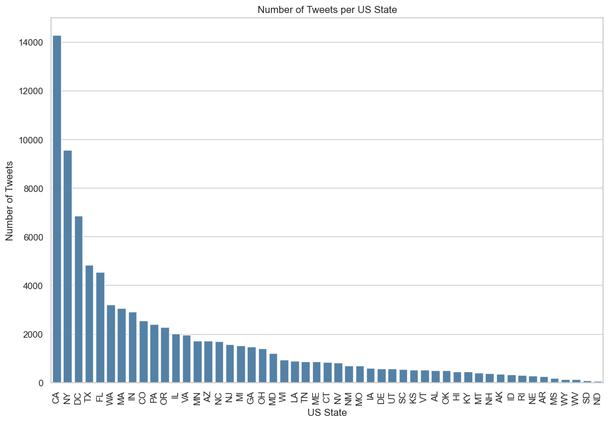
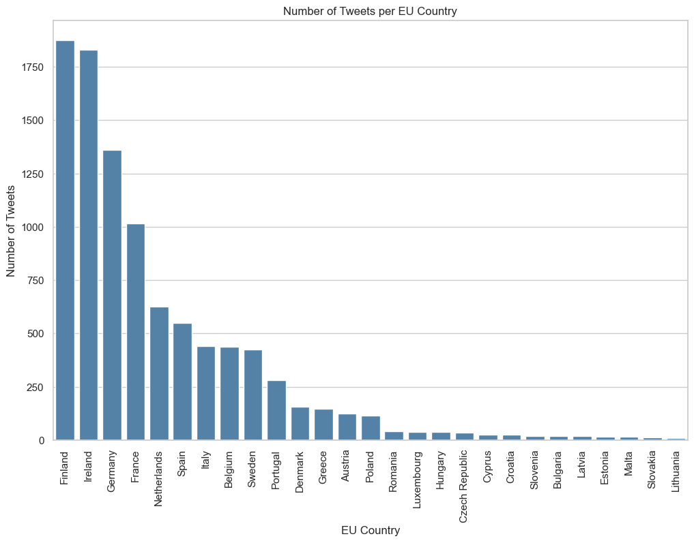

# big-data-final

## Task Outline
### 
1. Intro/Motivation: Why are you doing what you’re doing, what is your research question?
2. Data: How/where did you get your data? Explanation of the data (features), potentially accompanied by visualisations
3. Method: What kind of tools for data analysis are you using? How does it work? Potentially accompanied by code snippets
4. Results: What did you find out? Any cool insights? Accompanied by plots, visualizing your insights.
5. Conclusion: What worked, what didn’t? What would you do if you had to improve the project?

## Final Report and Specifications
###

**Intro/Motivation:**
In recent years, the conversation about climate change has heated up, with discussions about our planet’s future intensifying. The increasingly visible impact of extreme weather events and activism from figures like Greta Thunberg have played a leading role in mobilizing global communities.

Motivated by this apparent shift in public discourse, we wanted to examine climate change related tweets during the height of Thunberg’s influence between 2018-2020. What changes in sentiment can be observed in climate change discourse during this period and how does this vary among and between the EU and U.S?

In this project, we scraped approximately 110,000 tweets from both the EU and US and analyzed sentiment separately to understand the nuances of public opinion in these two different geopolitical regions. 

**Getting the Tweets** 

For our data we used TWScrape to scrape search results; we used it to acquire Tweets with the keyword 'climate change' across 2018, 2019, and 2020. Twscrape is a python library created in May 2023, and it utilizes Twitter's API to interact with their platform and retrieve the desired data. We had to create a Twitter account to get valid API credentials. We managed to achieve the following-

1. We managed to scrape 500-800 tweets for 10 randomly selected days/months between 2018-2020.
2. Our search query was "climate change". We debated using other key words like "Greta Thunberg" since it would result in tweets related to her political image and would affect the focus of our sentiment analysis away from climate change. We also realize that this limited our tweets from other languages and countries in the EU where English is not very widespread.
3. We noticed that the data was extremely strated 
   
*Data Wrangling:*
We had to do a considerable amount of data wrangling for our project, especially with regards to the user location, which we would later use for geoplotting. Since we could not access the geolocation of the tweets from Twitter API without payment, it was importance to standardize the self-reported user location and remove spam locations like "Purgatory". We also had to organize the tweets by states for the US and by country for the EU for the visualizations of nation-based sentiment.

After gathering the tweet data, we performed an initial exploratory analysis to examine the distribution of tweets across U.S. states and EU countries.

These barplots highlight the regional differences of Twitter usage between the U.S. and EU. This is likely attributed to the much higher Twitter user base in the U.S, leading to more contribution to discussions on topics like climate change.

**Method:**
*VADER* (Vibha)

*Climate analysis model* (Caroline)

*Data vizualization* (Maryam)

We used `pandas`, `matplotlib`, and `seaborn` to create the graphs of the climate data. We loaded the data to a `pandas` data frame from a GitHub link to the .csv files. Our main considerations were the frequency distribution of sentiment as well as sentiment score over the course of the three years in our designated time period. We plotted histograms of the frequency of the sentiment score, using the data from the entire time period. For both countries, the data was negatively skewed, indicating overwhelming positive sentiment across the board. This was a bit unexpected, as we thought that such a divise topic might create a lot of negative sentiment. 

We also developed lineplots mapping the sentiment score across the months, and separated the graphs by year; both countries were included on each graph for comparative purposes. Once created, we looked for general trends, as well as the sentiment surrounding significant events related to climate policy and discourse. In general, sentiment scores decreased throughout the three year time period. Additionally, the EU countries had more positive sentiment than the USA. The most notable event in 2018 was the United Nations Climate Change Conference (COP24) in December. Around that time, sentiment was high, but fell in the following month, perhaps due to discourse surrounding the event. For the first half of 2019, there were various student protests going on around Europe, which could be the cause of the general downwards trend in the EU data. Lastly, the COVID-19 pandemic starting in March 2020 produced an upwards trend in sentiment for a few months. Reflecting back on the time period, many people were discussing nature healing due to the lack of human pollution, as people worldwide were in quarantine. Both countries started to see a downward decline when the world started to reopen during the summer. 

**Results:** (All)

**Conclusion:** (Maryam) 

